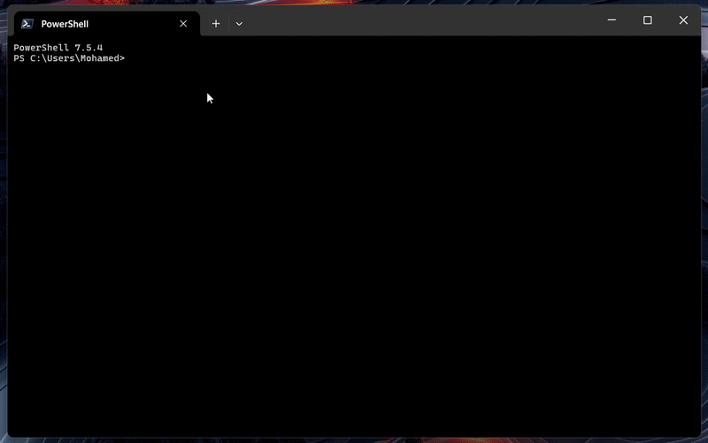

# 🪶 Raven

<p align="center">terminal-based AI chat interface.</p>

<p align="center">
  
  
  
</p>

---

<p align="center">
  
</p>

---

### Installation

```bash
# Clone and link locally
git clone https://github.com/yourusername/raven.git

# Navigate to raven's dir 
cd raven

# Install dependencies
npm install

## Option 1: Run directly with Node
node cli.js

## Option 2: Install globally and use anywhere
# Link the package globally
npm link

# Now you can run it from anywhere in your terminal
raven chat
```

To unlink later if needed:
```bash
npm unlink -g raven
```

> [!TIP]
> Make sure you have Node.js 18+ installed before running.


### Configuration

```bash
# Set provider
raven config set provider anthropic

# Set model
raven config set model claude-sonnet-4-5

# Set API keys
raven config set anthropic_api_key sk-ant-xxx
raven config set openai_api_key sk-xxx
raven config set groq_api_key gsk-xxx

# View current config
raven config list
```

### Supported Providers

Raven works with multiple AI providers out of the box. Switch between them anytime.

- **Anthropic** - Claude Sonnet 4.5, Claude Opus 4...
- **OpenAI** - GPT-4, GPT-4 Turbo, GPT-3.5 Turbo...
- **Groq** - Llama 3.1 70B, openai/gpt-oss-120b...

### Features

**Beautiful Rendering**
- Syntax highlighting for 50+ languages
- Auto-formatted tables and lists
- Real-time streaming responses
- Centered UI that adapts to any terminal width

**Conversation Management**
- Full context history maintained
- Provider-specific message formatting
- Error handling with graceful recovery

### Architecture

Raven is built with a modular architecture:

```
raven/
├── src/
│   ├── api/              # Provider integrations
│   │   ├── client.js     # API client initialization
│   │   ├── context.js    # Conversation management
│   │   └── providers/    # Provider implementations
│   ├── ui/
│   │   ├── components/   # Reusable UI components
│   │   ├── render/       # Markdown rendering engine
│   │   └── views/        # Main chat interface
│   └── cli.js            # CLI entry point
```

Each module is designed to be independent and testable.
